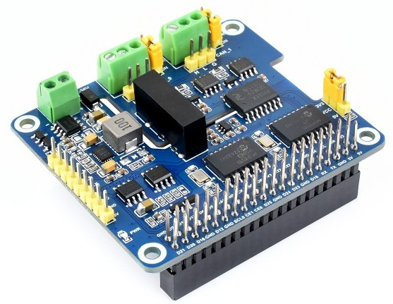
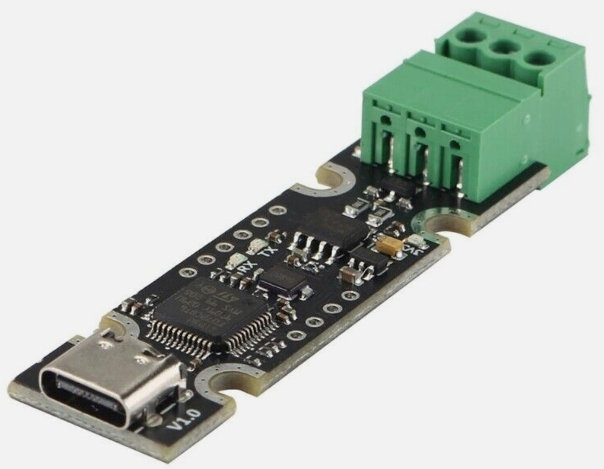

# BMS CAN Gateway

Multiplexing n x CAN - to - CAN and simultaneous CAN - to - MQTT Gateway
for LV (48V) Battery Management Systems using Pylontech Protocol.
---

Pylontech protocol, while imitating the SMA Sunny Island CAN-Bus BMS protocol,
has found widespread adoption for Low-Voltage (LV) Li-Ion
battery energy storage systems (BESS).

This is intended for (massive) parallel operation of multiple Low-Voltage
Lithium-Ion-Batteries which do not supply a paralleling option
by default. Battery data is also published via MQTT telemetry for
keeping track of system state and for system control.

This also allows for easy control of instantaneous influx and outgoing power
at any given time by setting and limiting battery current setpoint.

The Python code uses asyncio, async-enabled python-can and aiomqtt packages
for cooperative multitasking.

Battery-management CAN bus interface is supposed to be facilitated using
the Linux kernel socket-can API. Hardware interfaces are e.g. using the
Raspberry Pi and a multiple-CAN-bus-interface, or, alternatively, using
multiple USB-to-CAN adapters based on CANable-compatible firmware.

The gateway application is configured via text file in user home folder:
    ~/.bms_gateway/bms_config.toml

This file must be edited to suit application details.



Or, alternatively, using multiple USB-to-CAN adapters based on CANable-compatible firmware:



2025-04-25 Ulrich Lukas
## Incomplete and for testing purposes only!

## Installation
```
cd ~/src
git clone https://github.com/ul-gh/bms_gateway
cd bms_gateway
pip install .
```

## Usage
```
see help output of executable:
user@machine:~$ bms_gateway --help
```

Example output:
```

```
