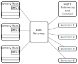

# BMS CAN Gateway
## Application Description:
Multiplexing n x m CAN-to-CAN and simultaneous CAN-to-MQTT Gateway
for LV (48V) Battery Management Systems using Pylontech Protocol.



Pylontech protocol, while imitating the SMA Sunny Island CAN-Bus BMS protocol,
has found widespread adoption for Low-Voltage (LV) Li-Ion
battery energy storage systems (BESS).

This is intended for (massive) parallel operation of one or more Low-Voltage
Lithium-Ion-Batteries which do not supply a paralleling option
by default, and/or for parallel operation of multiple LV battery inverters
connected to one or more batteries.

Battery data is also published via MQTT telemetry for
keeping track of system state and for system control.

This also allows for remote control of instantaneous influx and outgoing power
at any given time by setting current limit setpoint.

The Python code uses asyncio, async-enabled python-can and aiomqtt packages
for cooperative multitasking.

Battery-management CAN bus interface is facilitated using the Linux kernel
socket-can API. Hardware interfaces are e.g. using the Raspberry Pi and a
multiple-CAN-bus-interface, or, alternatively, using
multiple USB-to-CAN adapters based on CANable-compatible firmware.


## Operation Details:
The BMS gateway unifies input BMS states from all connected battery modules.
It does so by asynchronously gathering a complete set of input BMS state updates
and then calculating a total system characteristic result:

See BMS state representation in
[src/bms_gateway/bms_state.py](src/bms_gateway/bms_state.py):

* For input BMSes, data of this class represents one BMS state

* For total system characteristic state, this is calculated data:

    - For end-of-charge maximum voltage setpoint, for safety, the minimum of all
    voltages requested by the input BMSes is calculated

    - Limit values for total charging and discharging current are the sum of
    all limit values reported by input BMS

        ```
        Note: This assumes a well-tuned battery system current distribution
        i.e. each battery module receives a share of the total current which is
        proportional to its actual capacity and which does not exceed
        specification limits! This must be ensured by hardware design!
        ```

    - Total charging and discharging current are the sum of the measurements
    reported by all input BMS

    - Total battery capacity is also the sum of individual module capacities,
    however as this is not transmitted by all BMSes, it must be specified
    in the config file for each input module BMS

    - SOC, SOH, system voltage and temperature measurements (by the BMS)
    are averaged and weighted by individual capacity of the parallel battery
    modules. (See configuration file)

    - Error and warning flags are logically ORed

    - System status flags are individually treated

    - Calculation implemented in
    [BMSCombiner::calculate_result_state](
        src/bms_gateway/bms_state_combiner.py#calculate_result_state)


The unified system state is finally distributed to all configured inverters,
after applying inverter-specific, configurable settings.

For any of the connected inverters, the BMS gateway represents itself as a
single (virtual) BMS with individually calculated state.

The inverter specific settings to the total system state are applied in
[BMS_out::_bms_encode()](src/bms_gateway/lv_bms.py#_bms_encode)

* For every outgoing inverter, individual scaling and offset values can be
specified in config file. For only one inverter, the factor is usually 1.0. For
more than one connected inverter, the sum of all scaling factors should be 1.0.

* Current limits can be set individually per inverter, but these can only be
smaller than the total system limits

* Normal mode of operation is push mode towards all inverters:
We push a unified BMS state update to the connected inverters as soon as
it is available (calculated from all connected BMSes), optionally
introducing a delay if PUSH-MIN-DELAY is set > 0.0 in config.

* If SEND-SYNC-ACTIVATED is set in config, instead of push mode, we wait for an
inverter sync/acqknowledge-telegram (CAN-ID 0x305, data 8x 0x00) before sending
the state update. This will also enable a periodic task sending an outgoing
sync telegram periodically to initially and repeatedly trigger the cycle.


## Hardware interfaces

* Using the Raspberry Pi and SPI-bus connected, multi-port CAN-bus-interfaces.
These come with galvanic isolation:

    

* Using multiple USB-to-CAN adapters based on CANable-compatible firmware:

    


## System Software Installation

### Install BMS Gateway Application (Incomplete version for testing only!)

Clone and install bms_gateway Python package:

```bash
# This assumes an installed Linux base system, GIT and network connection
# and all hardware interfaces connected and powered.
mkdir -p ~/src && cd ~/src
git clone https://github.com/ul-gh/bms_gateway
cd bms_gateway
python3 -m venv venv
. venv/bin/activate
pip install .
```

Install or enable hardware drivers if necessary. As an example:

```bash
cat system/config.txt_rs485_can_hat_b | sudo tee -a /boot/firmware/config.txt
```

Reboot system if necessary to initialize drivers.

Then configure Linux socketcan drivers. There must be a dedicated hardware
CAN interface for each BMS or inverter!

In case of USB devices, interface names can change if ports are changed.
To prevent this, unique interface names based on serial number or similar data
can be set up using UDEV rules. See example in [HOWTO UDEV Rules.txt](
    system/HOWTO_UDEV_Rules.txt)

Then configure Linux networking subsystem. This example configures
three CAN interfaces, for 2x input BMS and 1x inverter.

```bash
cd ~/src/bms_gateway
sudo cp system/80-can.network /etc/systemd/network/
sudo systemctl enable systemd-networkd
sudo systemctl start systemd-networkd
# Check if interfaces are up
systemctl status systemd-networkd
ip a show
```

Install and enable bms_gateway as a system service:

```bash
cd ~/src/bms_gateway
cat system/bms_gateway.service | sed -e "s/GW_USERNAME/${USER}/" | \
sudo tee /etc/systemd/system/bms_gateway.service > /dev/null
systemctl enable bms_gateway
# Do not start service now as it is not yet configured
```

## Gateway Configuration
The gateway application is configured using a TOML configuration file which
must in any case be edited to suit application details. A template is stored at
[src/bms_gateway/bms_config_default.toml](src/bms_gateway/bms_config_default.toml).

Copy config template to .bms_gateway subfolder of user home and then edit
by running:

```bash
# Run app with --init option to initialize configuration
. ~/src/bms_gateway/venv/bin/activate
bms_gateway --init
# Using Vi as editor for example, edit configuration
vi ~/.bms_gateway/bms_config.toml
```

Structure of configuration file at ~/.bms_gateway/bms_config.toml:
```toml
#### BMS gateway configuration ####

# Set this to true to enable the gateway application!
GATEWAY-ACTIVATED = false


#### Settings for MQTT broadcaster.
#### System state (state of all parallel connected battery BMS) is encoded
#### in JSON format and pushed periodically on the specified topic.

[mqtt]
#...


#### Settings for total values of all parallel connected batteries

[battery]
#...


#### List here all configured output BMSes.
#### Each output BMS interface is supposed to be connected to an
#### inverter BMS CAN input using an individual CAN interface.

# First virtual (emulated) output BMS, connected to one physical inverter
[[bmses-out]]
#...

# Second inverter and so on...
[[bmses-out]]
#...


#### List here all configured input BMSes (connected to battery modules).
#### Each input BMS must be connected to an individual CAN interface.

# First input BMS (connected to one battery module BMS)
[[bmses-in]]
#...

# Second input BMS and so on...
[[bmses-in]]
#...
```

## Test Run
Run bms_gateway app with debug output for testing:

```bash
# Press CTRL-C to exit
. ~/src/bms_gateway/venv/bin/activate
bms_gateway --verbose
```

Example output:
```bash
FIXME: TBD
```

## Start Gateway System Service

If all is set up correctly, the system service can now be tested:

```bash
sudo systemctl start bms_gateway
# Test if it is running
sudo systemctl status bms_gateway
```
